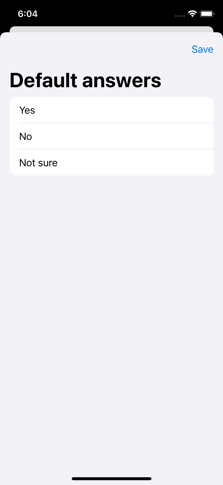
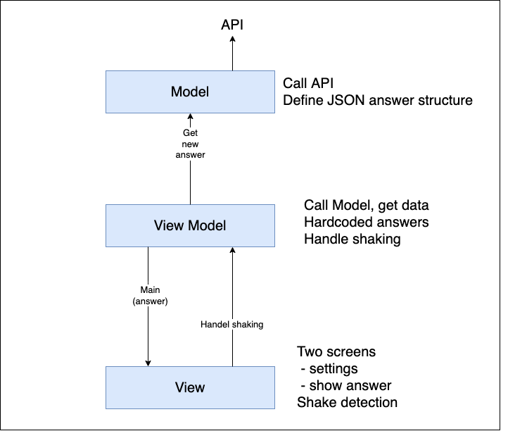

#  AskPifia

## Application to get answers on any question users ask by shaking device.

 User shake the device to get answers,application gets random answers and shows it on screen.  
 Application have two screens: Main and Settings 
1.  Main screen which have question(default value screen)/ after shaking change question to answer and rest buttom which turn screen to default value  screen to start new question
2. Settings screen which accepts user to set, save and use thier own answers. 

## User interface

Main Screen | Main Screen with answer | Setting Screen
:-----------:|:----------------------:|:-------------:
 |  | 

## Architecture

 Model–view–viewmodel (MVVM) is a software architectural pattern that facilitates the separation of the development of the graphical user interface (the view) – be it via a markup language or GUI code – from the development of the business logic or back-end logic (the model) so that the view is not dependent on any specific model platform.
 
 
